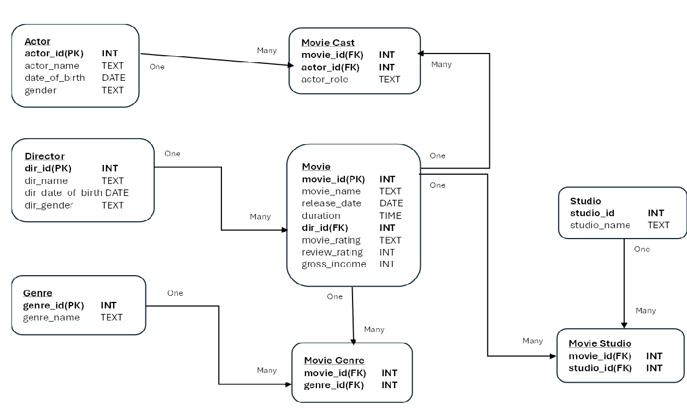
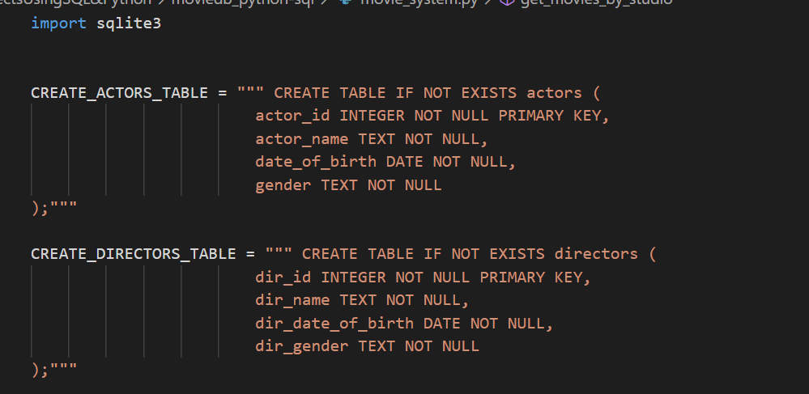
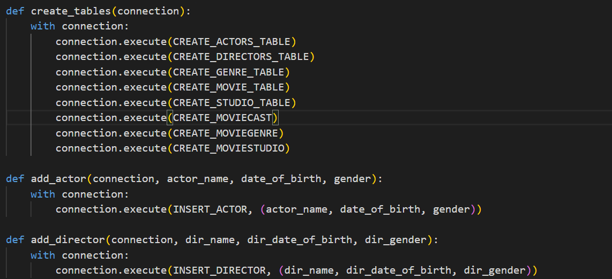
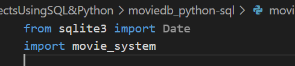
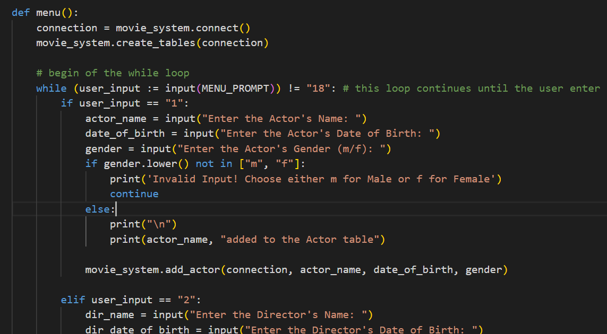
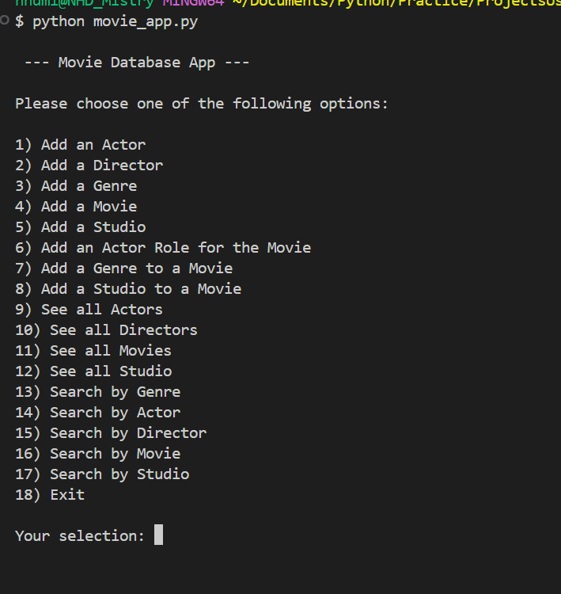
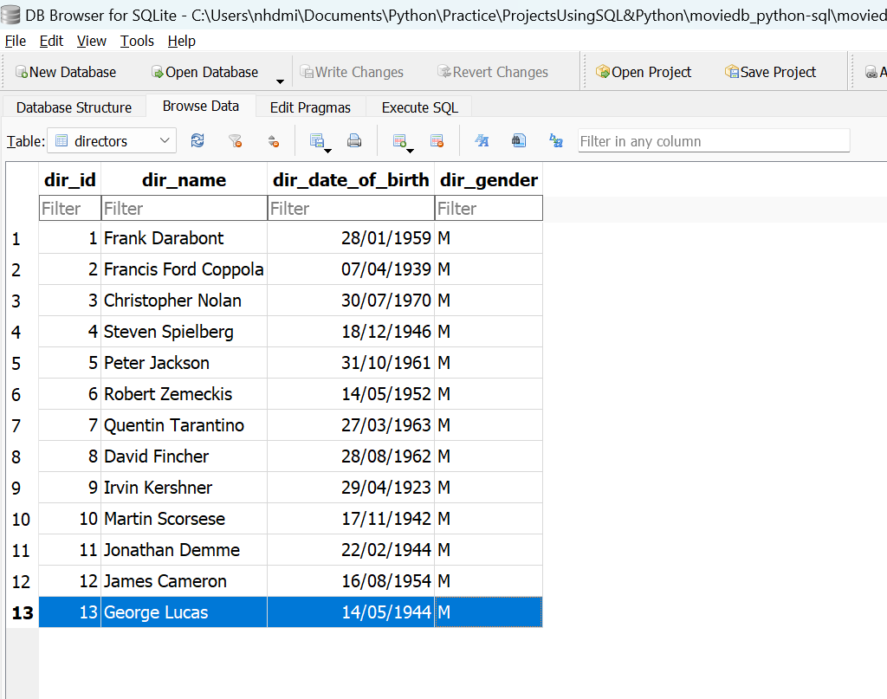

# Movie Database with Python & SQL tools

This project serves as a showcase of my skills in Python scripting language and SQL database management.

The SQLite database was specifically chosen for this project, with the sqlite3 module being used to establish a connection and execute SQL queries.

### Data Model
This is the data modelling of how each table are connected and relational between each table

### Preview of the code
movie_system.py file is first executed to get the connection to the SQLite database ready by creating the tables along with established SQL queries.

Creation of the table

Starting the connection to the database

movie_app.py is then execute for data input e.g: inputting Actors data, Directors data, Movies data and so on

Gets the connection from sqlite3 by importing the movie_system file

The below image is what needed to get a connection from the movie_system file and allows the user to input data to the database.

### Preview of movie_app.py file being executed

When the movie_app.py file is executed, a menu will be shown in the terminal containing a range of options for the user to choose from in order to input the data.

Here is an illustration of a scenario where an option is chosen, such as option 2, and the required information is provided. Once the necessary data is entered, it informs you about the location where the data is subsequently added.

Once the information above has been entered, it is subsequently transferred and stored in the SQLite database application, similar to the example provided.

To view the complete code, kindly refer to [movie_system.py](movie_system.py) and [movie_app.py](movie_app.py)