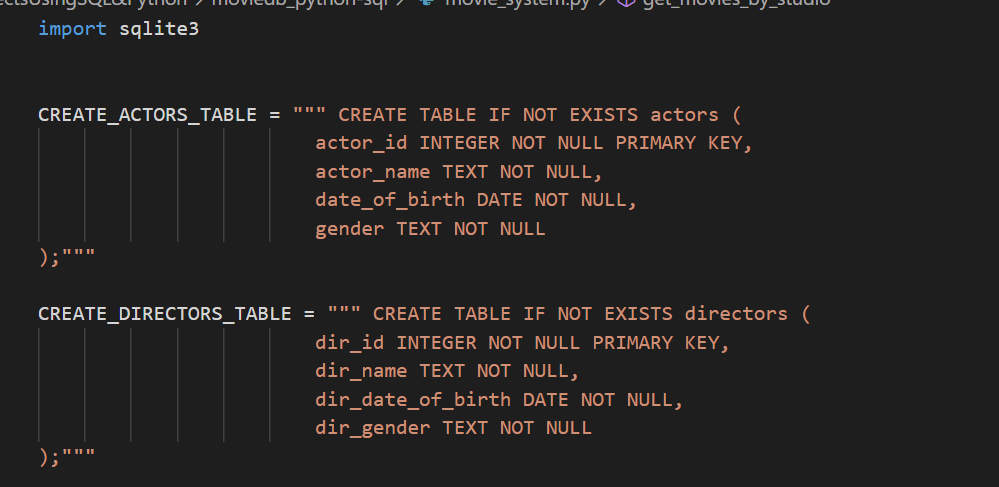
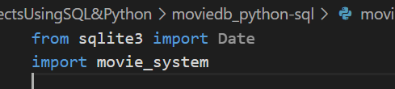
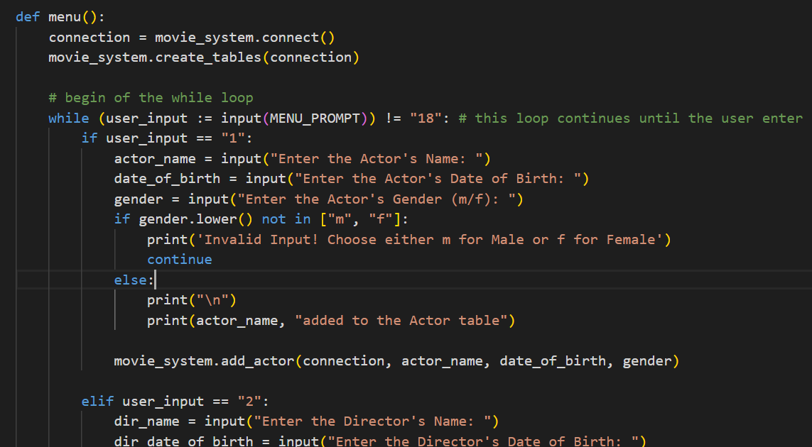

# Movie Database with Python & SQL tools

Developed a side project to demonstrate my proficiency in Python scripting language along with SQL database. 

SQLite is the database that was employed and the import module that was utilised was sqlite3. sqlite3 module was served as a connection to the SQLite database along with performing SQL query.

movie_system.py file is first executed to get the connection to the SQLite database ready by creating the tables along with established queries.

Preview of the movie_system.py code

Creation of the table

Connection to the database

movie_app.py is then execute for data input e.g: inputting Actors data, Directors data, Movies data and so on

When the movie_app.py file is executed, a menu will be shown containing a range of options for the user to choose from in order to input the data.

Here is an illustration of a scenario where an option is chosen, such as option 3, and the required information is provided. Once the necessary data is entered, it informs you about the location where the data is subsequently added.

Once the information above has been entered, it is subsequently transferred and stored in the SQLite database, similar to the example provided.

To view the complete code, kindly refer to movie_system.py and movie_app.py.